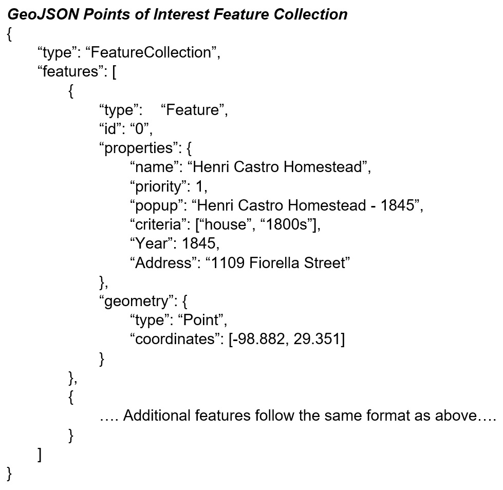
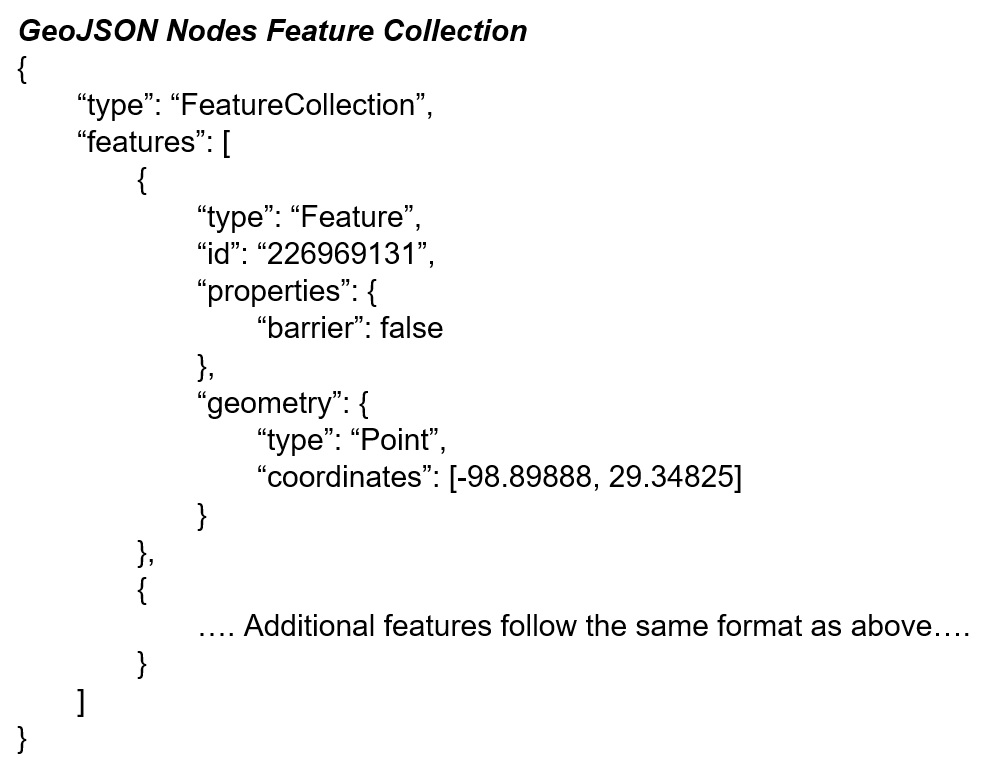
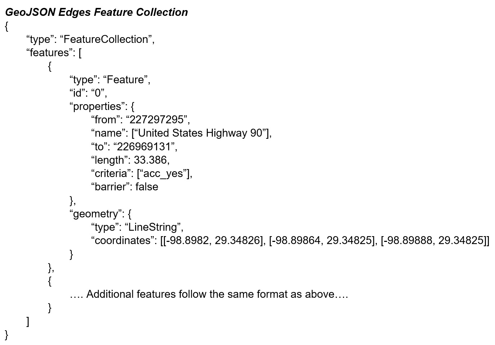
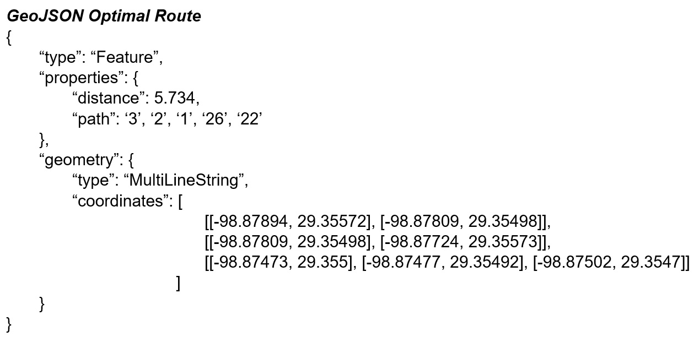

# Route30 User Guide
Route30 is a client-side routing library. It was developed as free and open-source software (FOSS).

Author: George Adams, Southwest Research Institute® (SwRI®)

Date: February 7, 2022

# Table of Contents
- [Input Data Files](#input_data_files)
- [Generated route](#generated_route)

## Input Data Files

There are three data files: 
1. POI (Points of Interest) file, poi.geojson: This file is created from scratch. It has the following GeoJSON structure:

      
    
    Field definitions:
    1. id, String \[required\]: unique identifier
    2. name, String: POI name
    3. priority, Integer: Priority was intended to be used when limiting the length of a path. It is not used in this implementation
    4. popup, String: Text to be displayed in a popup
    5. criteria, StringList \[required\]: Filter criteria specified as a list of strings
    6. Year, Integer: The year the property was built
    7. Address, String: The address of the property

    In this implementation, the poi.geojson file is used as input to the routing library. The only required fields for POIs in the routing library are the "id" field, the "criteria" field, and the geometry. The other fields are only used for the demo web app. Therefore, a different and shorter poi.geojson file could have been used for the routing library.  

2. Nodes file, nodes.geojson: This file represents the intersections of a street network. This file was downloaded from Harvard Dataverse (Boeing, 2017) as a shapefile. It was edited using QGIS to add a barrier field and then saved in GeoJSON format. It has the following GeoJSON structure:

      

    Field definitions:
    1. id, String \[required\]: unique identifier
    2. barrier, Boolean \[required\]: specifies if someone is prevented from passing through the intersection

3. Edges file, edges.geojson: This file represents the segments of a street network. This file was downloaded from Harvard Dataverse (Boeing, 2017) as a shapefile. It was edited using QGIS to reduce the number of fields and to add a criteria field and a barrier field and then saved in GeoJSON format. It has the following GeoJSON structure:

      

    Field definitions:
    1. id, String \[required\]: unique identifier
    2. from, String \[required\]: starting node (corresponds to a node in the nodes file)
    3. name, StringList: list of street names for this segment
    4. to, String \[required\]: ending node (corresponds to a node in the nodes file)
    5. length, Real (double) \[required\]: length of segment in meters
    6. criteria, StringList \[required\]: Filter criteria specified as a list of strings
    7. barrier, Boolean \[required\]: specifies if someone is prevented from traversing the segment

## Generated Route

The library returns the optimal route in GeoJSON format. It has the following GeoJSON Structure:  
  
  

The optimal route is a GeoJSON formatted output string containing a MultiLineString feature with a distance property and path property. The distance property provides the optimal route's distance; the path property provides the sequence of POIs on the optimal route.  

In a future enhancement, individual paths will be included in this output as a feature collection within the properties.

## References
Boeing, G. (2017). *U.S. Street Network Shapefiles, Node/Edge Lists, and GraphML Files.* https://doi.org/10.7910/DVN/CUWWYJ, Harvard Dataverse, V2.  